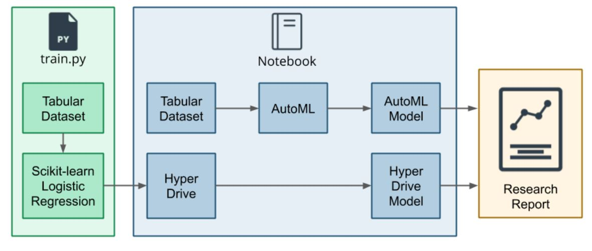

# Optimizing an ML Pipeline in Azure

## Overview

This project is part of the Udacity Azure ML Nanodegree.
In this project, we build and optimize an Azure ML pipeline using the Python SDK and a provided Scikit-learn model.
This model is then compared to an Azure AutoML run.

## Summary
**Problem Statement"**

Using the Bank Marketing Dataset, the aim of the project was to develop a prediction model for classification of clients' term subscription that is if a client will subscribe or not where the target label is a binary variable of `yes` or `no`. Further details about the dataset can be found <a href='https://archive.ics.uci.edu/ml/datasets/Bank+Marketing'>here</a>

**Solution**

Taking cue from the image shown, the solution adopted two(2) way approaches to solve the classfication task using the Microsoft Azure Hyperdrive and AutoML to train the dataset, where the Hyperdrive was leveraged on to optimize and tune hyperparameters of a custom Logistics regression model, while the Automated ML was also utilized to compare how the custom model performed against the automated

## Scikit-learn Pipeline
Scikit-Learn is a simple, robust and efficient tools for predictive data analysis which includes different algorithms and techniques such as Regression, Classification, Clustering, etc., however, for this project Logistic Regression which is a Linear model in Scikit learn was used. 

In developing the custom model to train, the basic data science pipeline was adopted as follows;

### Data Loading
The bankmarketing dataset was loaded into the datastore and workspace using the `TabularDatasetFactory`

### Data Processing and Modelling

After loading the dataset, the data was preprocessed and clean using the `cleandata` function before splitting the data into `train` and `test` for modelling and evaluation purposes. To train the model, `Logistic Regression` was adopted as the custom model algorithm and the two(2) hyperparameters used to train the model were `C` & `max_iter`. This was achieved by creating a SkLearn Estimator for training the Logistic Regression by passing it through the training script which served as input to the hyperdrive configuration.

RandomParameterSampling The parameter sampler used is the `RandomParameterSampling`, a class that defines random sampling over a hyperparameter search space. The parameter values are choosen from a set of discrete values or a distribution over a continuous range. So this makes the computation less expensive.

BanditPolicy BanditPolicy, an early termination policy which is based on slack factor/slack amount and evaluation_interval. If the primary metric is not within the specified `slack factor/slack amount`, the policy terminates any runsm and this is done with respect to the best performing training run.

## AutoML
The workflow for the AutoML is as follows:

* Import data using TabularDatasetFactory
* Cleaning of data - handling NULL values, one-hot encoding of categorical features and preprocessing of date
* Splitting of data into train and test data
* Configuration of AutoML
* Save the best model generated

After the final run, the best model is `VotingEnsemble classifier` with an accuracy score of *91.83%*

## Pipeline comparison

The model accuracy for the hyperdrive model is *91.6%* and the accuracy score for the AutoML is *91.83%*, which is an 0.23% difference in metric score which is dependent on the architecture for both model. In the instance of the hyperdrive custom model, there is a lot of manual fine-tuning and selection that will be required in terms of selecting the right hyperparameters to help increase the performance of the model which may be daunting, hence, there is less flexibility in the instance where a model may not necessarily perform well for a use case but there won't be a way to determine unless it is tested, however, the AutoML give the flexibility of exploring other algorithm and easy hyperparameter tuning.

## Future work
For future work, it will be interesting to explore ; 

1. Model fairnesss and interpretability to be able to determine which feature has the greatest predictive power and influence on the target
2. Carry out more Exploratory Data Dnalysis (EDA) to discover insights and trends which may be useful for the model to learn from
3. Taking cue from the EDA perform necessary feature engineering and feature selection which may be important to improve the performance of the model. 

